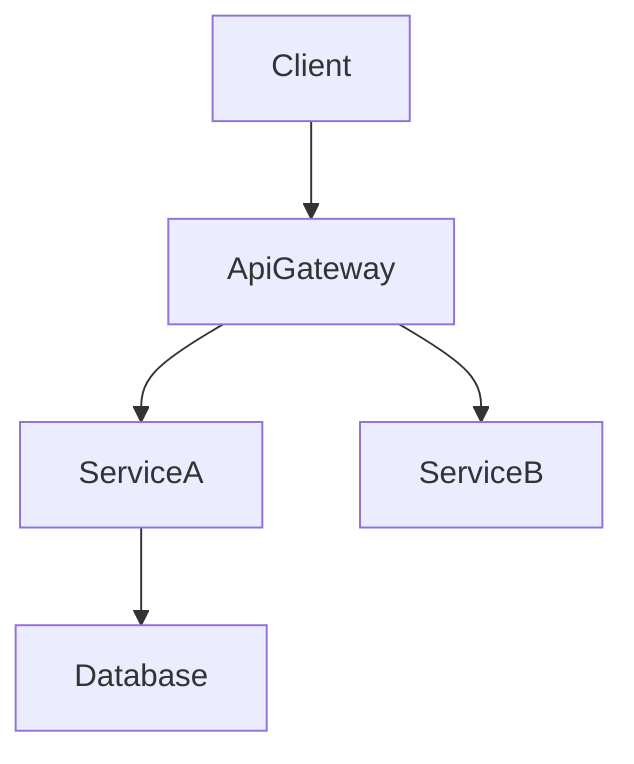

# Technical Design Rules and Principles

## Core Design Principles

### 1. Type Safety is Mandatory

- **NEVER** use `any` type in TypeScript interfaces
- Define explicit types for all parameters and returns
- Use discriminated unions for error handling
- Specify generic constraints clearly

### 2. Design vs Implementation

- **Focus on WHAT, not HOW**
- Define interfaces and contracts, not code
- Specify behavior through pre/post conditions
- Document architectural decisions, not algorithms

### 3. Visual Communication

- **Simple features**: Basic component diagram or none
- **Medium complexity**: Architecture + data flow
- **High complexity**: Multiple diagrams (architecture, sequence, state)
- **Always pure Mermaid**: No styling, just structure

### 4. Component Design Rules

- **Single Responsibility**: One clear purpose per component
- **Clear Boundaries**: Explicit domain ownership
- **Dependency Direction**: Follow architectural layers
- **Interface Segregation**: Minimal, focused interfaces
- **Team-safe Interfaces**: Design boundaries that allow parallel implementation without merge conflicts
- **Research Traceability**: Record boundary decisions and rationale in `research.md`

### 5. Data Modeling Standards

- **Domain First**: Start with business concepts
- **Consistency Boundaries**: Clear aggregate roots
- **Normalization**: Balance between performance and integrity
- **Evolution**: Plan for schema changes

### 6. Error Handling Philosophy

- **Fail Fast**: Validate early and clearly
- **Graceful Degradation**: Partial functionality over complete failure
- **User Context**: Actionable error messages
- **Observability**: Comprehensive logging and monitoring

### 7. Integration Patterns

- **Loose Coupling**: Minimize dependencies
- **Contract First**: Define interfaces before implementation
- **Versioning**: Plan for API evolution
- **Idempotency**: Design for retry safety
- **Contract Visibility**: Surface API and event contracts in design.md while linking extended details from `research.md`

## Documentation Standards

### Language and Tone

- **Declarative**: "The system authenticates users" not "The system should authenticate"
- **Precise**: Specific technical terms over vague descriptions
- **Concise**: Essential information only
- **Formal**: Professional technical writing

### Structure Requirements

- **Hierarchical**: Clear section organization
- **Traceable**: Requirements to components mapping
- **Complete**: All aspects covered for implementation
- **Consistent**: Uniform terminology throughout
- **Focused**: Keep design.md centered on architecture and contracts; move investigation logs and lengthy comparisons to `research.md`

## Section Authoring Guidance

### Global Ordering

- Default flow: Overview → Goals/Non-Goals → Requirements Traceability → Architecture → Technology Stack → System Flows → Components & Interfaces → Data Models → Optional sections.
- Teams may swap Traceability earlier or place Data Models nearer Architecture when it improves clarity, but keep section headings intact.
- Within each section, follow **Summary → Scope → Decisions → Impacts/Risks** so reviewers can scan consistently.

### Requirement IDs

- Reference requirements as `2.1, 2.3` without prefixes (no “Requirement 2.1”).
- All requirements MUST have numeric IDs. If a requirement lacks a numeric ID, stop and fix `requirements.md` before continuing.
- Use `N.M`-style numeric IDs where `N` is the top-level requirement number from requirements.md (for example, Requirement 1 → 1.1, 1.2; Requirement 2 → 2.1, 2.2).
- Every component, task, and traceability row must reference the same canonical numeric ID.

### Technology Stack

- Include ONLY layers impacted by this feature (frontend, backend, data, messaging, infra).
- For each layer specify tool/library + version + the role it plays; push extended rationale, comparisons, or benchmarks to `research.md`.
- When extending an existing system, highlight deviations from the current stack and list new dependencies.

### System Flows

- Add diagrams only when they clarify behavior:
  - **Sequence** for multi-step interactions
  - **Process/State** for branching rules or lifecycle
  - **Data/Event** for pipelines or async patterns
- Always use pure Mermaid. If no complex flow exists, omit the entire section.

### Requirements Traceability

- Use the standard table (`Requirement | Summary | Components | Interfaces | Flows`) to prove coverage.
- Collapse to bullet form only when a single requirement maps 1:1 to a component.
- Prefer the component summary table for simple mappings; reserve the full traceability table for complex or compliance-sensitive requirements.
- Re-run this mapping whenever requirements or components change to avoid drift.

### Components & Interfaces Authoring

- Group components by domain/layer and provide one block per component.
- Begin with a summary table listing Component, Domain, Intent, Requirement coverage, key dependencies, and selected contracts.
- Table fields: Intent (one line), Requirements (`2.1, 2.3`), Owner/Reviewers (optional).
- Dependencies table must mark each entry as Inbound/Outbound/External and assign Criticality (`P0` blocking, `P1` high-risk, `P2` informational).
- Summaries of external dependency research stay here; detailed investigation (API signatures, rate limits, migration notes) belongs in `research.md`.
- design.md must remain a self-contained reviewer artifact. Reference `research.md` only for background, and restate any conclusions or decisions here.
- Contracts: tick only the relevant types (Service/API/Event/Batch/State). Unchecked types should not appear later in the component section.
- Service interfaces must declare method signatures, inputs/outputs, and error envelopes. API/Event/Batch contracts require schema tables or bullet lists covering trigger, payload, delivery, idempotency.
- Use **Integration & Migration Notes**, **Validation Hooks**, and **Open Questions / Risks** to document rollout strategy, observability, and unresolved decisions.
- Detail density rules:
  - **Full block**: components introducing new boundaries (logic hooks, shared services, external integrations, data layers).
  - **Summary-only**: presentational/UI components with no new boundaries (plus a short Implementation Note if needed).
- Implementation Notes must combine Integration / Validation / Risks into a single bulleted subsection to reduce repetition.
- Prefer lists or inline descriptors for short data (dependencies, contract selections). Use tables only when comparing multiple items.

### Shared Interfaces & Props

- Define a base interface (e.g., `BaseUIPanelProps`) for recurring UI components and extend it per component to capture only the deltas.
- Hooks, utilities, and integration adapters that introduce new contracts should still include full TypeScript signatures.
- When reusing a base contract, reference it explicitly (e.g., “Extends `BaseUIPanelProps` with `onSubmitAnswer` callback”) instead of duplicating the code block.

### Data Models

- Domain Model covers aggregates, entities, value objects, domain events, and invariants. Add Mermaid diagrams only when relationships are non-trivial.
- Logical Data Model should articulate structure, indexing, sharding, and storage-specific considerations (event store, KV/wide-column) relevant to the change.
- Data Contracts & Integration section documents API payloads, event schemas, and cross-service synchronization patterns when the feature crosses boundaries.
- Lengthy type definitions or vendor-specific option objects should be placed in the Supporting References section within design.md, linked from the relevant section. Investigation notes stay in `research.md`.
- Supporting References usage is optional; only create it when keeping the content in the main body would reduce readability. All decisions must still appear in the main sections so design.md stands alone.

### Error/Testing/Security/Performance Sections

- Record only feature-specific decisions or deviations. Link or reference organization-wide standards (steering) for baseline practices instead of restating them.

### Diagram & Text Deduplication

- Do not restate diagram content verbatim in prose. Use the text to highlight key decisions, trade-offs, or impacts that are not obvious from the visual.
- When a decision is fully captured in the diagram annotations, a short “Key Decisions” bullet is sufficient.

### General Deduplication

- Avoid repeating the same information across Overview, Architecture, and Components. Reference earlier sections when context is identical.
- If a requirement/component relationship is captured in the summary table, do not rewrite it elsewhere unless extra nuance is added.

## Diagram Guidelines

### When to include a diagram

- **Architecture**: Use a structural diagram when 3+ components or external systems interact.
- **Sequence**: Draw a sequence diagram when calls/handshakes span multiple steps.
- **State / Flow**: Capture complex state machines or business flows in a dedicated diagram.
- **ER**: Provide an entity-relationship diagram for non-trivial data models.
- **Skip**: Minor one-component changes generally do not need diagrams.

### Mermaid requirements

- **Plain Mermaid only** – avoid custom styling or unsupported syntax.
- **Node IDs** – alphanumeric plus underscores only (e.g., `Client`, `ServiceA`). Do not use `@`, `/`, or leading `-`.
- **Labels** – simple words. Do not embed parentheses `()`, square brackets `[]`, quotes `"`, or slashes `/`.
  - ❌ `DnD[@dnd-kit/core]` → invalid ID (`@`).
  - ❌ `UI[KanbanBoard(React)]` → invalid label (`()`).
  - ✅ `DndKit[dnd-kit core]` → use plain text in labels, keep technology details in the accompanying description.
  - ℹ️ Mermaid strict-mode will otherwise fail with errors like `Expecting 'SQE' ... got 'PS'`; remove punctuation from labels before rendering.
- **Edges** – show data or control flow direction.
- **Groups** – using Mermaid subgraphs to cluster related components is allowed; use it sparingly for clarity.

## Quality Metrics

### Design Completeness Checklist

- All requirements addressed
- No implementation details leaked
- Clear component boundaries
- Explicit error handling
- Comprehensive test strategy
- Security considered
- Performance targets defined
- Migration path clear (if applicable)

### Common Anti-patterns to Avoid

❌ Mixing design with implementation
❌ Vague interface definitions
❌ Missing error scenarios
❌ Ignored non-functional requirements
❌ Overcomplicated architectures
❌ Tight coupling between components
❌ Missing data consistency strategy
❌ Incomplete dependency analysis
