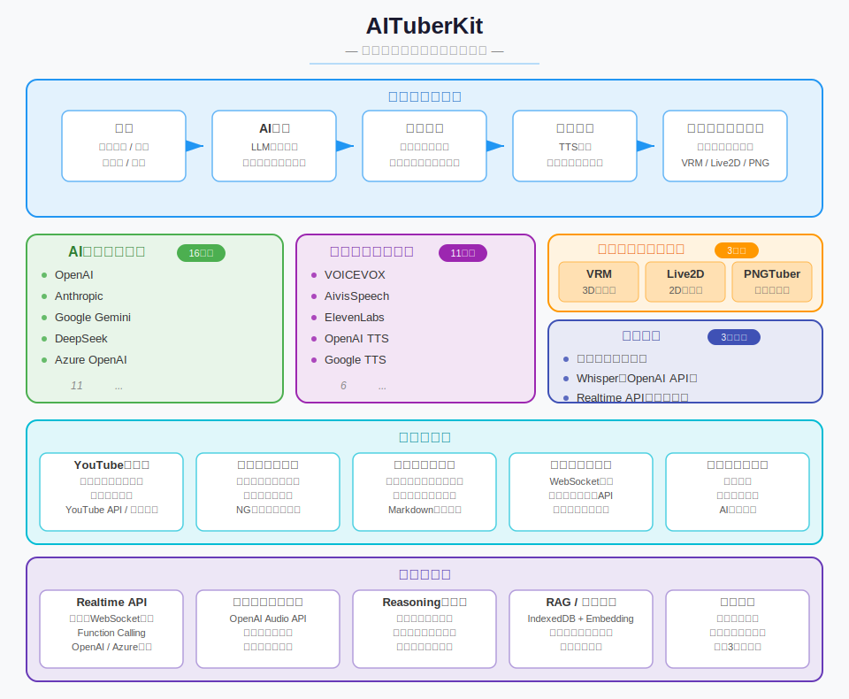

# AITuberKit


**お知らせ: 本プロジェクトはバージョン v2.0.0 以降、カスタムライセンスを採用しています。商用目的でご利用の場合は、[利用規約](#利用規約) セクションをご確認ください。**

<p align="center">
   <a href="https://github.com/tegnike/aituber-kit"></a>
   <a href="https://github.com/tegnike/aituber-kit"></a>
   
   <a href="https://github.com/tegnike/aituber-kit/blob/main/LICENSE"></a>
</p>
<p align="center">
   <a href="https://github.com/tegnike/aituber-kit/stargazers"></a>
   <a href="https://github.com/tegnike/aituber-kit/network/members"></a>
   <a href="https://github.com/tegnike/aituber-kit/graphs/contributors"></a>
   <a href="https://github.com/tegnike/aituber-kit/issues"></a>
   <a href="https://coderabbit.ai/tegnike/aituber-kit"></a>
</p>
<p align="center">
   <a href="https://x.com/tegnike"></a>
   <a href="https://discord.gg/5rHEue52nZ"></a>
   <a href="https://github.com/sponsors/tegnike"></a>
   <a href="https://deepwiki.com/tegnike/aituber-kit"></a>
</p>

<div align="center">
   <h3>
      🌟 <a href="https://aituberkit.com">デモサイトへ</a> 🌟
   </h3>
</div>

<div align="center">
   <h3>
      📚 <a href="https://docs.aituberkit.com/">ドキュメントサイトへ</a> 📚
   </h3>
</div>

<h3 align="center">
   <a href="./docs/README_en.md">English</a>｜
   <a href="./docs/README_zh.md">中文</a>｜
   <a href="./docs/README_ko.md">한국어</a>｜
   <a href="./docs/README_pl.md">Polski</a>
</h3>

## 概要

AITuberKitは、誰でも簡単にAIキャラクターとチャットできるWebアプリケーションを構築できるオープンソースのツールキットです。<br>
豊富なAIサービス、キャラクターモデル、音声合成エンジンに対応し、高いカスタマイズ性を備えた対話機能とAITuber配信機能を中心に、様々な拡張モードを提供しています。



詳細な使用方法や設定方法については、[ドキュメントサイト](https://docs.aituberkit.com/)をご覧ください。

## Star History

[](https://star-history.com/#tegnike/aituber-kit&Date)

## 主な機能

### 1. AIキャラとの対話

- 各種LLMのAPIキーを使って、AIキャラクターと簡単に会話可能
- マルチモーダル対応で、カメラからの映像やアップロードした画像を認識して回答を生成
- 直近の会話文を記憶として保持

### 2. AITuber配信

- YouTubeの配信コメントを取得して、AIキャラクターが自動で応答
- 会話継続モードでコメントがなくても自発的に発言可能
- "#"から始まるコメントは読まれない機能

### 3. その他の機能

- **外部連携モード**: WebSocketでサーバーアプリと連携し、より高度な機能を実現
- **スライドモード**: AIキャラクターがスライドを自動で発表するモード
- **Realtime API**: OpenAIのRealtime APIを使用した低遅延対話と関数実行
- **オーディオモード**: OpenAIのAudio API機能を活用した自然な音声対話
- **メッセージ受信機能**: 専用APIを通じて外部から指示を受け付け、AIキャラクターに発言させることが可能

## 対応モデル・サービス

### キャラクターモデル

- **3Dモデル**: VRMファイル
- **2Dモデル**: Live2Dファイル（Cubism 3以降）

### 対応LLM

- OpenAI
- Anthropic
- Google Gemini
- Azure OpenAI
- Groq
- Cohere
- Mistral AI
- Perplexity
- Fireworks
- ローカルLLM
- Dify

### 対応音声合成エンジン

- VOICEVOX
- Koeiromap
- Google Text-to-Speech
- Style-Bert-VITS2
- AivisSpeech
- Aivis Cloud API
- Cartesia
- GSVI TTS
- ElevenLabs
- OpenAI
- Azure OpenAI
- にじボイス

## クイックスタート

### 開発環境

- Node.js: ^20.0.0
- npm: ^10.0.0

### インストール手順

1. リポジトリをローカルにクローンします。

```bash
git clone https://github.com/tegnike/aituber-kit.git
```

2. フォルダを開きます。

```bash
cd aituber-kit
```

3. パッケージインストールします。

```bash
npm install
```

4. 開発モードでアプリケーションを起動します。

```bash
npm run dev
```

5. URLを開きます。[http://localhost:3000](http://localhost:3000)

6. 必要に応じて.envファイルを作成します。

```bash
cp .env.example .env
```

詳細な設定方法や使用方法については、[ドキュメントサイト](https://docs.aituberkit.com/)をご覧ください。

## ⚠️ セキュリティに関する重要な注意事項

このリポジトリは、個人利用やローカル環境での開発はもちろん、適切なセキュリティ対策を施した上での商用利用も想定しています。ただし、Web環境にデプロイする際は以下の点にご注意ください：

- **APIキーの取り扱い**: バックエンドサーバーを経由してAIサービス（OpenAI, Anthropic等）やTTSサービスのAPIを呼び出す仕様となっているため、APIキーの適切な管理が必要です。

### 本番環境での利用について

本番環境で利用する場合は、以下のいずれかの対応を推奨します：

1. **バックエンドサーバーの実装**: APIキーの管理をサーバーサイドで行い、クライアントからの直接的なAPIアクセスを避ける
2. **利用者への適切な説明**: 各利用者が自身のAPIキーを使用する場合は、セキュリティ上の注意点について説明する
3. **アクセス制限の実装**: 必要に応じて、適切な認証・認可の仕組みを実装する

## スポンサー募集

開発を継続するためにスポンサーの方を募集しています。<br>
あなたの支援は、AITuberKitの開発と改善に大きく貢献します。

[](https://github.com/sponsors/tegnike)

[](https://buymeacoffee.com/fdanv1k6iz)

### 協力者の皆様（ご支援いただいた順）

<p>
  <a href="https://github.com/morioki3" title="morioki3">
    
  </a>
  <a href="https://github.com/hodachi-axcxept" title="hodachi-axcxept">
    
  </a>
  <a href="https://github.com/coderabbitai" title="coderabbitai">
    
  </a>
  <a href="https://github.com/ai-bootcamp-tokyo" title="ai-bootcamp-tokyo">
    
  </a>
  <a href="https://github.com/wmoto-ai" title="wmoto-ai">
    
  </a>
  <a href="https://github.com/JunzoKamahara" title="JunzoKamahara">
    
  </a>
  <a href="https://github.com/darkgaldragon" title="darkgaldragon">
    
  </a>
  <a href="https://github.com/usagi917" title="usagi917">
    
  </a>
  <a href="https://github.com/ochisamu" title="ochisamu">
    
  </a>
  <a href="https://github.com/mo0013" title="mo0013">
    
  </a>
  <a href="https://github.com/tsubouchi" title="tsubouchi">
    
  </a>
  <a href="https://github.com/bunkaich" title="bunkaich">
    
  </a>
  <a href="https://github.com/seiki-aliveland" title="seiki-aliveland">
    
  </a>
  <a href="https://github.com/rossy8417" title="rossy8417">
    
  </a>
  <a href="https://github.com/gijigae" title="gijigae">
    
  </a>
  <a href="https://github.com/takm-reason" title="takm-reason">
    
  </a>
  <a href="https://github.com/haoling" title="haoling">
    
  </a>
  <a href="https://github.com/FoundD-oka" title="FoundD-oka">
    
  </a>
  <a href="https://github.com/terisuke" title="terisuke">
    
  </a>
  <a href="https://github.com/konpeita" title="konpeita">
    
  </a>
  <a href="https://github.com/MojaX2" title="MojaX2">
    
  </a>
  <a href="https://github.com/micchi99" title="micchi99">
    
  </a>
  <a href="https://github.com/nekomeowww" title="nekomeowww">
    
  </a>
  <a href="https://github.com/yfuku" title="yfuku">
    
  </a>
  <a href="https://x.com/8484ff_42" title="8484ff_42">
    
  </a>
  <a href="https://github.com/sher1ock-jp" title="sher1ock-jp">
    
  </a>
  <a href="https://github.com/uwaguchi" title="uwaguchi">
    
  </a>
  <a href="https://x.com/M1RA_A_Project" title="M1RA_A_Project">
    
  </a>
  <a href="https://github.com/teruPP" title="teruPP">
    
  </a>
  <a href="https://github.com/aituber-akari" title="aituber-akari">
    
  </a>
  <a href="https://github.com/harumeri" title="harumeri">
    
  </a>
  <a href="https://github.com/spring-hh" title="spring-hh">
    
  </a>
  <a href="https://github.com/dotneet" title="dotneet">
    
  </a>
  <a href="https://github.com/schroneko" title="schroneko">
    
  </a>
</p>

他、プライベートスポンサー 複数名

## 貢献

AITuberKitの発展にご協力いただき、ありがとうございます。コミュニティからの貢献を歓迎しています。

### イシューの報告

バグを見つけたり、新機能のアイデアがある場合は、GitHubの[Issues](https://github.com/tegnike/aituber-kit/issues)ページからぜひ教えてください。

イシューを作成する際に、以下の情報を含めていただけると対応がスムーズになります：

- 問題や新機能の詳細な説明
- 再現手順（バグの場合）
- 期待される動作と実際の動作
- 使用環境（ブラウザ、OS、Node.jsのバージョンなど）
- スクリーンショットや動画（可能であれば）

### プルリクエスト

コードの改善や新機能の追加をしたい場合は、フォークしたリポジトリで変更を加え、プルリクエストを作成してください。

- 1つのプルリクエストでは、1つの機能または修正に焦点を当てるようにしてください。
- プルリクエストの説明には、変更内容と理由を書いてください。
- マージ先のブランチは必ず `develop` に設定してください。
- コンフリクトは無理に解消しなくても問題ありません。開発チームが対応します。

## 利用規約

### ライセンス

本プロジェクトは、バージョン v2.0.0 以降、**カスタムライセンス**を採用しています。

- **無償利用**

  - 営利目的以外での個人利用、教育目的、非営利目的での使用は無償で利用可能です。

- **商用ライセンス**
  - 商用目的での使用に関しては、別途商用ライセンスの取得が必要です。
  - 詳細は、[ライセンスについて](./docs/license.md)をご確認ください。

### その他

- [ロゴの利用規約](./docs/logo_licence.md)
- [VRMおよびLive2Dモデルの利用規約](./docs/character_model_licence.md)

## 優先実装について

本プロジェクトでは、有償での機能優先実装を受け付けています。

- 企業や個人の方から要望のあった機能を、優先的に実装することが可能です。
- 実装された機能は、本OSSプロジェクトの一部として公開されます。
- 料金は機能の複雑さや実装に要する時間に応じて個別見積もりとなります。
- この優先実装は商用ライセンスとは別の取り組みです。実装された機能を商用利用する場合は、別途商用ライセンスの取得が必要です。

詳細については、support@aituberkit.com までお問い合わせください。
