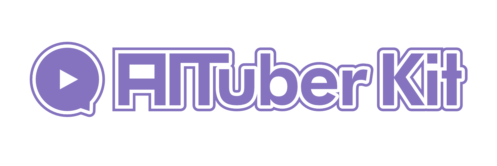

# AITuberKit



**공지사항: 버전 v2.0.0부터 이 프로젝트는 커스텀 라이선스를 채택하고 있습니다. 상업적 목적으로 사용하실 경우 [이용 약관](#이용-약관) 섹션을 확인해 주시기 바랍니다.**

<p align="center">
   <a href="https://github.com/tegnike/aituber-kit"></a>
   <a href="https://github.com/tegnike/aituber-kit"></a>
   
   <a href="https://github.com/tegnike/aituber-kit/blob/main/LICENSE"></a>
</p>
<p align="center">
   <a href="https://github.com/tegnike/aituber-kit/stargazers"></a>
   <a href="https://github.com/tegnike/aituber-kit/network/members"></a>
   <a href="https://github.com/tegnike/aituber-kit/graphs/contributors"></a>
   <a href="https://github.com/tegnike/aituber-kit/issues"></a>
</p>
<p align="center">
   <a href="https://x.com/tegnike"></a>
   
   <a href="https://discord.gg/5rHEue52nZ"></a>
   <a href="https://github.com/sponsors/tegnike"></a>
</p>

<div align="center">
   <h3>
      🌟 <a href="https://aituberkit.com">Demo Site</a> 🌟
   </h3>
</div>

<h3 align="center">
   <a href="../README.md">【일본어】</a>｜
   <a href="./README_en.md">【영어】</a>｜
   <a href="./README_zh.md">【중국어】</a>
</h3>

## Star History

[](https://star-history.com/#tegnike/aituber-kit&Date)

## 개요

이 저장소에는 주로 다음과 같은 2가지 기능이 있습니다.

1. AI 캐릭터와 대화
2. AITuber 스트리밍

아래 기사에 자세한 사용 방법을 작성했습니다.

[](https://note.com/nike_cha_n/n/ne98acb25e00f)

## ⚠️ 보안에 관한 중요 주의사항

이 저장소는 개인 사용과 로컬 환경에서의 개발은 물론, 적절한 보안 대책을 마련한 상태에서의 상업적 사용도 고려하고 있습니다. 단, 웹 환경에 배포할 때는 다음 사항에 주의해 주시기 바랍니다:

- **API 키 취급**: 백엔드 서버를 통해 AI 서비스(OpenAI, Anthropic 등)와 TTS 서비스의 API를 호출하는 사양이므로, API 키의 적절한 관리가 필요합니다.

### 프로덕션 환경에서의 사용에 대하여

프로덕션 환경에서 사용할 경우, 다음 중 하나의 대응을 권장합니다:

1. **백엔드 서버 구현**: API 키 관리를 서버 사이드에서 수행하여 클라이언트로부터의 직접적인 API 접근을 피하기
2. **사용자에 대한 적절한 설명**: 각 사용자가 자신의 API 키를 사용하는 경우, 보안상의 주의사항에 대해 설명하기
3. **접근 제한 구현**: 필요에 따라 적절한 인증・인가 메커니즘을 구현하기

## 개발 환경

이 프로젝트는 다음과 같은 환경에서 개발되었습니다:

- Node.js: ^20.0.0
- npm: 10.8.1

## 공통 사전 준비

1. 리포지토리를 로컬에 클론합니다.

```bash
git clone https://github.com/tegnike/aituber-kit.git
```

2. 폴더를 엽니다.

```bash
cd aituber-kit
```

3. 패키지를 설치합니다.

```bash
npm install
```

4. 개발 모드에서 애플리케이션을 시작합니다.

```bash
npm run dev
```

5. URL을 엽니다. [http://localhost:3000](http://localhost:3000)

6. 필요에 따라 .env 파일을 만듭니다.

```bash
cp .env.example .env
```

## AI 캐릭터와 대화

- AI 캐릭터와 대화할 수 있는 기능입니다.
- 이 저장소의 기반이 되는 [pixiv/ChatVRM](https://github.com/pixiv/ChatVRM)을 확장한 기능입니다.
- 각종 LLM의 API 키만 있으면 쉽게 시작할 수 있습니다.
- 최근의 대화 문장을 기억으로 보존합니다.
- 멀티모달로, 카메라에서의 영상이나 업로드한 이미지를 인식하여 답변을 생성할 수 있습니다.

### 사용 방법

1. 설정 화면에서 각종 LLM의 API 키를 입력합니다.
   - OpenAI
   - Anthropic
   - Google Gemini
   - Azure OpenAI
   - Groq
   - Cohere
   - Mistral AI
   - Perplexity
   - Fireworks
   - 로컬 LLM
   - Dify (Chatbot or Agent)
2. 필요한 경우 캐릭터의 설정 프롬프트를 편집합니다.
3. 필요한 경우 캐릭터의 VRM 파일 또는 Live2D 파일, 및 배경 파일을 업로드합니다.
4. 음성 합성 엔진을 선택하고 필요한 경우 음성 설정을 구성합니다.
   - VOICEVOX: 여러 옵션에서 스피커를 선택할 수 있습니다. 사전에 VOICEVOX 앱을 실행해야 합니다.
   - Koeiromap: 세밀하게 음성을 조정할 수 있습니다. API 키가 필요합니다.
   - Google TTS: 일본어 외의 언어도 선택 가능합니다. credential 정보가 필요합니다.
   - Style-Bert-VITS2: 로컬 API 서버를 실행해야 합니다.
   - AivisSpeech: 사전에 AivisSpeech 앱을 실행해야 합니다.
   - GSVI TTS: 로컬 API 서버를 실행해야 합니다.
   - ElevenLabs: 다양한 언어 선택이 가능합니다. API 키를 입력하세요.
   - OpenAI: API 키가 필요합니다.
   - Azure OpenAI: API 키가 필요합니다.
   - Nijivoice: API 키가 필요합니다.
5. 입력 양식에서 캐릭터와 대화를 시작합니다. 마이크 입력도 가능합니다.

## AITuber 스트리밍

- YouTube 스트리밍 댓글을 가져와서 캐릭터가 말하도록 할 수 있습니다.
- YouTube API 키가 필요합니다.
- '#'로 시작하는 댓글은 읽히지 않습니다.

### 사용 방법

1. 설정 화면에서 YouTube 모드를 켭니다.
2. YouTube API 키와 YouTube Live ID를 입력합니다.
3. 다른 설정은 "AI 캐릭터와 대화"와 동일한 방식으로 구성합니다.
4. YouTube에서 스트리밍을 시작하고 캐릭터가 댓글에 반응하는지 확인합니다.
5. 대화 연속 모드를 켜면 댓글이 없어도 AI가 스스로 발언할 수 있습니다.

## 기타 기능

### 외부 연계 모드

- WebSocket을 통해 서버 앱에 요청을 전송하고 응답을 받을 수 있습니다.
- 별도의 서버 앱을 준비해야 합니다.

#### 사용 방법

1. 서버 앱을 시작하고 `ws://127.0.0.1:8000/ws` 엔드포인트를 엽니다.
2. 설정 화면에서 외부 연계 모드를 켭니다.
3. 다른 설정은 "AI 캐릭터와 대화"와 동일한 방식으로 구성합니다.
4. 입력 양식에서 요청을 전송하고 서버 앱에서 응답이 반환되는지 확인합니다.

#### 관련 사항

- 내가 만든 서버 앱 저장소로 시도해볼 수 있습니다. [tegnike/aituber-server](https://github.com/tegnike/aituber-server)
- 자세한 설정은 "[아름다운 소녀와 함께 개발해 보자!! 【Open Interpreter】](https://note.com/nike_cha_n/n/nabcfeb7aaf3f)"를 읽어보세요.

### 슬라이드 모드

- AI 캐릭터가 자동으로 슬라이드를 발표하는 모드입니다.
- 사전에 슬라이드와 스크립트 파일을 준비해야 합니다.

#### 사용 방법

1. AI 캐릭터와 대화할 수 있는 단계까지 진행합니다.
2. 지정된 폴더에 슬라이드 폴더와 스크립트 파일을 배치합니다.
3. 설정 화면에서 슬라이드 모드를 켭니다.
4. 슬라이드 시작 버튼을 눌러 발표를 시작합니다.

### Realtime API 모드

- OpenAI의 Realtime API를 사용하여 낮은 지연으로 캐릭터와 대화할 수 있는 모드입니다.
- 함수 실행을 정의할 수 있습니다.

#### 사용 방법

1. AI 서비스에서 OpenAI 또는 Azure OpenAI를 선택합니다.
2. Realtime API 모드를 켭니다.
3. 마이크를 사용하여 대화합니다.

#### 함수 실행

- src/components/realtimeAPITools.tsx, src/components/realtimeAPITools.json에 새로운 함수를 정의합니다.
- 기존의 get_current_weather 함수를 참고하세요.

## 팁

### Live2D 사양에 대하여

Live2D 표시를 위해 비공식 라이브러리 [pixi-live2d-display](https://github.com/RaSan147/pixi-live2d-display)를 사용하고 있습니다.

Live2D는 개발용 SDK로 Cubism이라는 라이브러리를 제공하고 있으며, 현재 Cubism 2.1, Cubism 3, Cubism 4, 그리고 Cubism 5가 존재합니다. Cubism 4는 Cubism 3 모델과 호환성이 있으며, 최신 Cubism 5는 Cubism 4와 호환성이 있습니다.

Cubism 2.1과 Cubism 4/5를 사용함으로써 모든 버전의 Live2D 모델을 지원합니다.

#### Cubism Core

이 기능을 사용하기 전에, 다음 Cubism Core (Cubism 런타임 라이브러리) 파일을 모두 `public/scripts`에 설치해야 합니다:

1. `live2dcubismcore.min.js` (Cubism 4/5)

   - [공식 사이트](https://www.live2d.com/sdk/download/web/)에서 다운로드 가능
   - 또는 [이곳](https://cubism.live2d.com/sdk-web/cubismcore/live2dcubismcore.min.js)에서 다운로드 가능 (참고: 프로덕션 환경에서의 사용은 권장되지 않습니다)

2. `live2d.min.js` (Cubism 2.1)
   - 2019년 9월 4일 이후, 공식 사이트에서는 다운로드할 수 없습니다. 다음에서 다운로드 가능:
     - GitHub: [dylanNew/live2d](https://github.com/dylanNew/live2d/tree/master/webgl/Live2D/lib)
     - CDN: https://cdn.jsdelivr.net/gh/dylanNew/live2d/webgl/Live2D/lib/live2d.min.js

두 파일을 설치하면 모든 버전의 Live2D 모델을 지원할 수 있습니다.

### 배경 이미지 설정

- `public/bg-c.png`에서 배경 이미지를 변경합니다. 이름은 변경하지 마십시오.

### 환경 변수 설정

- 일부 구성 값은 `.env` 파일 내용에서 참조할 수 있습니다.
- 설정 화면에 입력된 경우 해당 값이 우선적으로 적용됩니다.

### 마이크 입력 방법 (2가지 패턴)

1. Alt (또는 option) 키를 누르고 있는 동안 입력 => 떼면 전송
2. 마이크 버튼 클릭 (한 번 클릭하면 입력 시작) => 다시 클릭하면 전송

### 기타

- 대화 내역은 설정 화면에서 재설정할 수 있니다.
- 다양한 설정 항목은 브라우저에 저장됩니다.
- 코드 블록으로 둘러싸인 요소는 TTS에서 읽히지 않습니다.

## 관련 기사

- [오늘부터 당신도 AITuber 개발자｜니케짱](https://note.com/nike_cha_n/n/ne98acb25e00f)
- [미소녀와 함께 개발해보자!! [Open Interpreter]](https://note.com/nike_cha_n/n/nabcfeb7aaf3f)
- [슬라이드 발표는 AI가 하는 시대!!!!](https://note.com/nike_cha_n/n/n867081a598f1)
- [AITuberKit에 멀티모달 기능을 추가해서 AI 캐릭터와 집에서 한잔 해보자](https://note.com/nike_cha_n/n/n6d8e330561e4)
- [AITuberKit × Dify로 초간단 챗봇 구축](https://note.com/nike_cha_n/n/n13cd8b3cf88a)
- [Dify를 Xserver에서 인터넷에 공개하기](https://note.com/nike_cha_n/n/n23467824b22b)
- [고급 음성 모드인 Realtime API를 시도해보자](https://note.com/nike_cha_n/n/ne51c16ddadd0)

## 스폰서 모집

개발을 지속하기 위해 스폰서를 모집하고 있습니다.<br>
여러분의 지원은 AITuber 키트의 개발과 개선에 크게 기여합니다.

[](https://github.com/sponsors/tegnike)

[](https://buymeacoffee.com/fdanv1k6iz)

### 협력자 여러분 (지원해 주신 순서)

<p>
  <a href="https://github.com/morioki3" title="morioki3">
    
  </a>
  <a href="https://github.com/hodachi-axcxept" title="hodachi-axcxept">
    
  </a>
  <a href="https://github.com/coderabbitai" title="coderabbitai">
    
  </a>
  <a href="https://github.com/ai-bootcamp-tokyo" title="ai-bootcamp-tokyo">
    
  </a>
  <a href="https://github.com/wmoto-ai" title="wmoto-ai">
    
  </a>
  <a href="https://github.com/JunzoKamahara" title="JunzoKamahara">
    
  </a>
  <a href="https://github.com/darkgaldragon" title="darkgaldragon">
    
  </a>
  <a href="https://github.com/usagi917" title="usagi917">
    
  </a>
  <a href="https://github.com/ochisamu" title="ochisamu">
    
  </a>
  <a href="https://github.com/mo0013" title="mo0013">
    
  </a>
  <a href="https://github.com/tsubouchi" title="tsubouchi">
    
  </a>
  <a href="https://github.com/bunkaich" title="bunkaich">
    
  </a>
  <a href="https://github.com/seiki-aliveland" title="seiki-aliveland">
    
  </a>
  <a href="https://github.com/rossy8417" title="rossy8417">
    
  </a>
  <a href="https://github.com/gijigae" title="gijigae">
    
  </a>
  <a href="https://github.com/takm-reason" title="takm-reason">
    
  </a>
  <a href="https://github.com/haoling" title="haoling">
    
  </a>
  <a href="https://github.com/FoundD-oka" title="FoundD-oka">
    
  </a>
  <a href="https://github.com/terisuke" title="terisuke">
    
  </a>
  <a href="https://github.com/konpeita" title="konpeita">
    
  </a>
  <a href="https://github.com/MojaX2" title="MojaX2">
    
  </a>
</p>

그 외, 다수의 비공개 스폰서

## 이용 약관

### 라이선스

버전 v2.0.0부터 이 프로젝트는 **커스텀 라이선스**를 채택하고 있습니다.

- **무상 이용**

  - 영리 목적이 아닌 개인 사용, 교육 목적, 비영리 목적의 사용은 무상으로 이용 가능합니다.

- **상업용 라이선스**
  - 상업적 목적으로 사용하는 경우에는 별도의 상업용 라이선스 취득이 필요합니다.
  - 자세한 내용은 [라이선스 관련](./license_en.md)을 확인해 주시기 바랍니다.

## 우선 구현에 대하여

이 프로젝트는 유료로 기능 우선 구현을 받고 있습니다.

- 기업이나 개인의 요청이 있는 기능을 우선적으로 구현할 수 있습니다.
- 구현된 기능은 이 프로젝트의 일부로 공개됩니다.
- 요금은 기능의 복잡도와 구현에 필요한 시간에 따라 개별 견적으로 진행됩니다.
- 이 우선 구현은 상업용 라이선스와는 별개의 작업입니다. 구현된 기능을 상업적으로 사용하려면 별도의 상업용 라이선스를 취득해야 합니다.

자세한 내용은 support@aituberkit.com 으로 문의해 주시기 바랍니다.

### 기타

- [로고 이용 약관](./logo_licence_en.md)
- [VRM 및 Live2D 모델 이용 약관](./character_model_licence_en.md)
