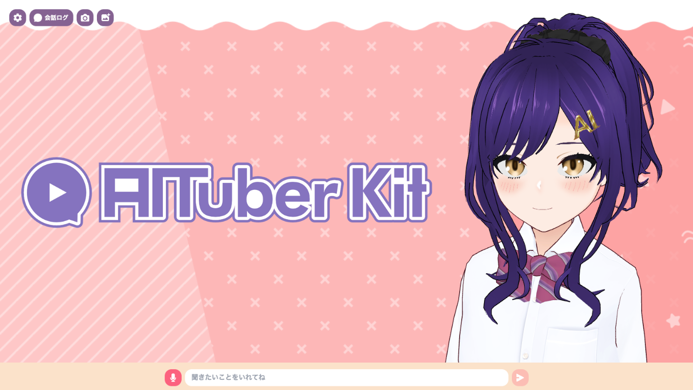
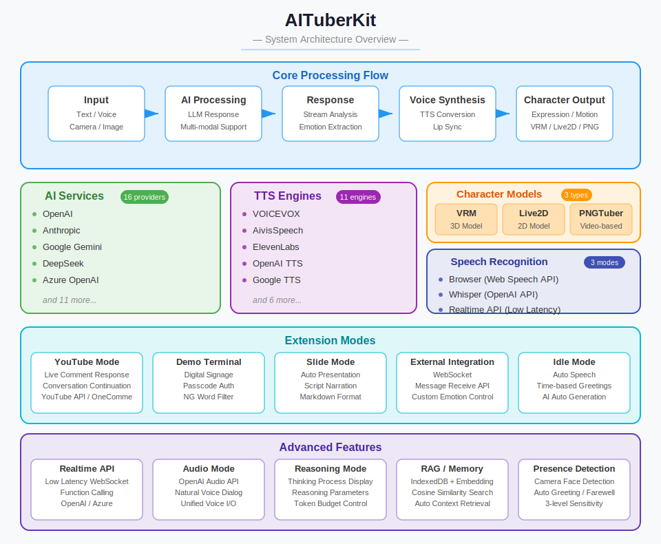

# AITuberKit



<p align="center"><strong>Kompleksowy zestaw narzędzi do budowy postaci AI</strong></p>

**Ogłoszenie: Od wersji v2.0.0 projekt ten przyjął niestandardową licencję. W przypadku użytku komercyjnego prosimy o zapoznanie się z sekcją [Warunki użytkowania](#warunki-użytkowania).**

<p align="center">
   <a href="https://github.com/tegnike/aituber-kit"></a>
   <a href="https://github.com/tegnike/aituber-kit"></a>
   
   <a href="https://github.com/tegnike/aituber-kit/blob/main/LICENSE"></a>
</p>
<p align="center">
   <a href="https://github.com/tegnike/aituber-kit/stargazers"></a>
   <a href="https://github.com/tegnike/aituber-kit/network/members"></a>
   <a href="https://github.com/tegnike/aituber-kit/graphs/contributors"></a>
   <a href="https://github.com/tegnike/aituber-kit/issues"></a>
   <a href="https://coderabbit.ai/tegnike/aituber-kit"></a>
</p>
<p align="center">
   <a href="https://x.com/tegnike"></a>
   <a href="https://discord.gg/5rHEue52nZ"></a>
   <a href="https://github.com/sponsors/tegnike"></a>
   <a href="https://deepwiki.com/tegnike/aituber-kit"></a>
</p>

<div align="center">
   <h3>
      🌟 <a href="https://aituberkit.com">Przejdź do strony demo</a> 🌟
   </h3>
</div>

<div align="center">
   <h3>
      📚 <a href="https://docs.aituberkit.com/en/">Przejdź do dokumentacji</a> 📚
   </h3>
</div>

<div align="center">
   <h3>
      🚀 <a href="https://promotion.aituberkit.com/">Strona promocyjna</a> 🚀
   </h3>
</div>

<h3 align="center">
   <a href="../README.md">日本語</a>｜
   <a href="./README_en.md">English</a>｜
   <a href="./README_zh-CN.md">简体中文</a>｜
   <a href="./README_zh-TW.md">繁體中文</a>｜
   <a href="./README_ko.md">한국어</a>
</h3>

## Przegląd

AITuberKit to zestaw narzędzi open source, który pozwala każdemu łatwo zbudować aplikację internetową do czatowania z postaciami AI.<br>
Obsługuje różnorodne usługi AI, modele postaci i silniki syntezy mowy, oferując różne tryby rozszerzeń, koncentrując się na funkcjach dialogowych i streamingowych AITuber z wysokim stopniem personalizacji.



Szczegółowe instrukcje użytkowania i konfiguracji można znaleźć w [dokumentacji](https://docs.aituberkit.com/en/).

## Główne funkcje

### 1. Interakcja z postaciami AI

- Łatwa rozmowa z postaciami AI przy użyciu kluczy API różnych LLM
- Obsługa multimodalna z rozpoznawaniem obrazów z kamery i przesłanych zdjęć
- Zachowywanie ostatnich rozmów w pamięci
- Długoterminowa pamięć oparta na RAG, wykorzystująca przeszłe rozmowy jako kontekst

### 2. Streaming AITuber

- Automatyczne odpowiedzi postaci AI na komentarze ze streamów YouTube
- Możliwość wyboru źródła komentarzy: YouTube API / OneComme (WanKome)
- Tryb ciągłej rozmowy umożliwiający spontaniczne wypowiedzi nawet bez komentarzy
- Konfigurowalne interwały pobierania komentarzy i wyświetlana nazwa użytkownika

### 3. Terminal demonstracyjny i signage cyfrowy

- **Tryb terminala demonstracyjnego**: Wyświetlanie pełnoekranowe dla signage cyfrowego. Obsługuje uwierzytelnianie kodem, filtr słów zabronionych i limity długości danych wejściowych
- **Detekcja obecności**: Automatyczne wykrywanie odwiedzających poprzez detekcję twarzy z kamery. Obsługuje automatyczne odtwarzanie powitań i pożegnań
- **Tryb bezczynności**: Postać wypowiada się automatycznie, gdy rozmowa ustaje. Obsługuje trzy źródła: stałe frazy, powitania zależne od pory dnia i treści generowane przez AI

### 4. Zaawansowane tryby dialogu

- **Realtime API**: Rozmowy i wykonywanie funkcji z niskim opóźnieniem przy użyciu OpenAI Realtime API
- **Tryb audio**: Naturalna konwersacja głosowa wykorzystująca OpenAI Audio API
- **Tryb Reasoning**: Wyświetlanie procesu myślowego AI i konfiguracja parametrów wnioskowania

### 5. Integracja i rozszerzenia

- **Tryb integracji zewnętrznej**: Zaawansowane funkcje, w tym wymiana tekstu i obrazów, poprzez połączenie WebSocket z aplikacją serwerową
- **Tryb prezentacji**: Tryb automatycznej prezentacji slajdów przez postać AI
- **Funkcja odbierania wiadomości**: Możliwość przyjmowania tekstu i obrazów z zewnętrznych źródeł poprzez dedykowane API, aby postać AI mogła się wypowiadać

## Obsługiwane modele i usługi

### Modele postaci

- **Modele 3D**: Pliki VRM (obsługuje kontrolę pozy i gestów za pomocą tagów ruchu)
- **Modele 2D**: Pliki Live2D (Cubism 3 i nowsze)
- **Motion PNGTuber**: Wyświetlanie postaci oparte na wideo ([MotionPNGTuber](https://github.com/rotejin/MotionPNGTuber))

### Obsługiwane LLM

- OpenAI
- Anthropic
- Google Gemini
- Azure OpenAI
- Groq
- Cohere
- Mistral AI
- Perplexity
- Fireworks
- LM Studio
- Ollama
- Dify
- xAI
- DeepSeek
- OpenRouter

### Obsługiwane silniki syntezy mowy

- VOICEVOX
- Koeiromap
- Google Text-to-Speech
- Style-Bert-VITS2
- AivisSpeech
- Aivis Cloud API
- Cartesia
- GSVI TTS
- ElevenLabs
- OpenAI
- Azure OpenAI

## Szybki start

### Środowisko programistyczne

- Node.js: 24.x
- npm: ^11.6.2

### Instrukcje instalacji

1. Sklonuj repozytorium lokalnie.

```bash
git clone https://github.com/tegnike/aituber-kit.git
```

2. Otwórz folder.

```bash
cd aituber-kit
```

3. Zainstaluj pakiety.

```bash
npm install
```

4. W razie potrzeby utwórz plik .env.

```bash
cp .env.example .env
```

5. Uruchom aplikację w trybie deweloperskim.

```bash
npm run dev
```

6. Otwórz URL: [http://localhost:3000](http://localhost:3000)

### Szybkie uruchamianie

Po zakończeniu wstępnej konfiguracji możesz uruchomić aplikację po prostu dwukrotnie klikając skrypt uruchamiający.

- **Windows**: Kliknij dwukrotnie `LAUNCH.bat`
- **macOS**: Kliknij dwukrotnie `LAUNCH.command` (jeśli nie masz uprawnień do wykonania, uruchom `chmod +x LAUNCH.command`)

Szczegółowe instrukcje konfiguracji i użytkowania można znaleźć w [dokumentacji](https://docs.aituberkit.com/en/).

### Uruchamianie z Docker

1. Utwórz plik `.env`.

```bash
cp .env.example .env
```

2. Uruchom za pomocą Docker Compose.

```bash
docker compose up -d
```

3. Otwórz URL: [http://localhost:3000](http://localhost:3000)

Aby zatrzymać:

```bash
docker compose down
```

## Wdrażanie

### Vercel

1. Utwórz konto na [Vercel](https://vercel.com/) i zaimportuj repozytorium GitHub.

2. Ustaw zmienne środowiskowe w panelu Vercel. Dodaj wymagane klucze API (np. `OPENAI_API_KEY`). Dostępne zmienne środowiskowe znajdziesz w `.env.example`.

3. Wdrażanie jest automatycznie wykonywane po wypchnięciu do Production Branch w ustawieniach projektu (domyślnie gałąź `main`).

### Cloudflare Workers

Obsługiwane jest wdrażanie na Cloudflare Workers. Użyj [OpenNext](https://opennext.js.org/) do uruchomienia aplikacji Next.js na Cloudflare Workers.

1. Zainstaluj [Wrangler CLI](https://developers.cloudflare.com/workers/wrangler/) i zaloguj się na konto Cloudflare.

2. W razie potrzeby zmień nazwę projektu w `wrangler.jsonc`.

3. Ustaw zmienne środowiskowe.
   - **Ustawienia frontendu (`NEXT_PUBLIC_*`)**: Zapisz je w pliku `.env`. Są osadzane w kodzie klienta podczas budowania.
   - **Klucze API po stronie serwera (`OPENAI_API_KEY` itp.)**: Ustaw je jako sekrety Wrangler.

```bash
cp .env.example .env
# Edytuj .env, aby ustawić wartości NEXT_PUBLIC_*

# Ustaw klucze API po stronie serwera jako sekrety Wrangler
npx wrangler secret put OPENAI_API_KEY
```

Powtórz `wrangler secret put` dla każdego wymaganego klucza API.

4. Zweryfikuj działanie za pomocą lokalnego podglądu.

```bash
npm run preview:cloudflare
```

5. Wdróż w środowisku produkcyjnym.

```bash
npm run deploy:cloudflare
```

**Uwagi:**

- Podczas budowania automatycznie ustawiane jest `NEXT_PUBLIC_RESTRICTED_MODE=true`, co wyłącza API systemu plików. Lista zasobów jest dostarczana z manifestów generowanych podczas budowania.
- Pliki w `public/` przekraczające 25MB lub z nazwami plików zawierającymi znaki spoza ASCII są automatycznie wykluczane z wdrożenia.

## ⚠️ Ważne uwagi dotyczące bezpieczeństwa

To repozytorium jest przeznaczone zarówno do użytku osobistego i rozwoju w środowisku lokalnym, jak i do użytku komercyjnego z odpowiednimi środkami bezpieczeństwa. Jednak podczas wdrażania w środowisku internetowym należy zwrócić uwagę na następujące punkty:

- **Obsługa kluczy API**: Ponieważ system jest zaprojektowany do wywoływania API usług AI (OpenAI, Anthropic itp.) i usług TTS poprzez serwer backendowy, wymagane jest odpowiednie zarządzanie kluczami API.

### Użycie w środowisku produkcyjnym

W przypadku użycia w środowisku produkcyjnym zalecane jest jedno z następujących podejść:

1. **Implementacja serwera backendowego**: Zarządzanie kluczami API po stronie serwera i unikanie bezpośredniego dostępu do API z klienta
2. **Odpowiednie instrukcje dla użytkowników**: W przypadku gdy użytkownicy używają własnych kluczy API, wyjaśnienie kwestii bezpieczeństwa
3. **Implementacja kontroli dostępu**: W razie potrzeby wdrożenie odpowiednich mechanizmów uwierzytelniania i autoryzacji

## Poszukiwani sponsorzy

Poszukujemy sponsorów, aby kontynuować rozwój.<br>
Twoje wsparcie znacząco przyczyni się do rozwoju i ulepszania AITuberKit.

[](https://github.com/sponsors/tegnike)

[](https://buymeacoffee.com/fdanv1k6iz)

### Współpracownicy (w kolejności wsparcia)

<p>
  <a href="https://github.com/morioki3" title="morioki3">
    
  </a>
  <a href="https://github.com/hodachi-axcxept" title="hodachi-axcxept">
    
  </a>
  <a href="https://github.com/coderabbitai" title="coderabbitai">
    
  </a>
  <a href="https://github.com/wmoto-ai" title="wmoto-ai">
    
  </a>
  <a href="https://github.com/JunzoKamahara" title="JunzoKamahara">
    
  </a>
  <a href="https://github.com/darkgaldragon" title="darkgaldragon">
    
  </a>
  <a href="https://github.com/usagi917" title="usagi917">
    
  </a>
  <a href="https://github.com/ochisamu" title="ochisamu">
    
  </a>
  <a href="https://github.com/mo0013" title="mo0013">
    
  </a>
  <a href="https://github.com/tsubouchi" title="tsubouchi">
    
  </a>
  <a href="https://github.com/bunkaich" title="bunkaich">
    
  </a>
  <a href="https://github.com/seiki-aliveland" title="seiki-aliveland">
    
  </a>
  <a href="https://github.com/rossy8417" title="rossy8417">
    
  </a>
  <a href="https://github.com/gijigae" title="gijigae">
    
  </a>
  <a href="https://github.com/takm-reason" title="takm-reason">
    
  </a>
  <a href="https://github.com/haoling" title="haoling">
    
  </a>
  <a href="https://github.com/FoundD-oka" title="FoundD-oka">
    
  </a>
  <a href="https://github.com/terisuke" title="terisuke">
    
  </a>
  <a href="https://github.com/konpeita" title="konpeita">
    
  </a>
  <a href="https://github.com/MojaX2" title="MojaX2">
    
  </a>
  <a href="https://github.com/micchi99" title="micchi99">
    
  </a>
  <a href="https://github.com/nekomeowww" title="nekomeowww">
    
  </a>
  <a href="https://github.com/yfuku" title="yfuku">
    
  </a>
  <a href="https://x.com/8484ff_42" title="8484ff_42">
    
  </a>
  <a href="https://github.com/sher1ock-jp" title="sher1ock-jp">
    
  </a>
  <a href="https://github.com/uwaguchi" title="uwaguchi">
    
  </a>
  <a href="https://x.com/M1RA_A_Project" title="M1RA_A_Project">
    
  </a>
  <a href="https://github.com/teruPP" title="teruPP">
    
  </a>
  <a href="https://github.com/aituber-akari" title="aituber-akari">
    
  </a>
  <a href="https://github.com/harumeri" title="harumeri">
    
  </a>
  <a href="https://github.com/spring-hh" title="spring-hh">
    
  </a>
  <a href="https://github.com/dotneet" title="dotneet">
    
  </a>
  <a href="https://github.com/schroneko" title="schroneko">
    
  </a>
  <a href="https://github.com/ParachutePenguin" title="ParachutePenguin">
    
  </a>
  <a href="https://github.com/eruma" title="eruma">
    
  </a>
  <a href="https://x.com/_cityside" title="_cityside">
    
  </a>
  <a href="https://github.com/nyapan-mohy" title="nyapan-mohy">
    
  </a>
  <a href="https://github.com/hattoritatsuya" title="hattoritatsuya">
    
  </a>
  <a href="https://github.com/sa1p" title="sa1p">
    
  </a>
</p>

Plus kilku prywatnych sponsorów

## Historia gwiazdek

[](https://star-history.com/#tegnike/aituber-kit&Date)

## Podziękowania

Ten projekt został opracowany jako fork [ChatVRM](https://github.com/pixiv/ChatVRM) opublikowanego przez pixiv Inc. Głęboko doceniamy pixiv Inc. za udostępnienie tak wspaniałego projektu open source.

## Wkład

Dziękujemy za zainteresowanie rozwojem AITuberKit. Witamy wkład od społeczności.

### Zgłaszanie problemów

Jeśli znalazłeś błąd lub masz pomysł na nową funkcję, poinformuj nas o tym na stronie [Issues](https://github.com/tegnike/aituber-kit/issues) na GitHub.

Podczas tworzenia problemu, podanie następujących informacji pomoże nam w płynnej odpowiedzi:

- Szczegółowy opis problemu lub nowej funkcji
- Kroki reprodukcji (dla błędów)
- Oczekiwane zachowanie vs. rzeczywiste zachowanie
- Szczegóły środowiska (przeglądarka, system operacyjny, wersja Node.js, itp.)
- Zrzuty ekranu lub wideo (jeśli to możliwe)

### Pull Requests

Jeśli chcesz poprawić kod lub dodać nowe funkcje, wprowadź zmiany w swoim sforkowanym repozytorium i stwórz pull request.

- Skup się na jednej funkcji lub poprawce na pull request.
- Opisz zmiany i powód ich wprowadzenia w opisie pull request.
- Zawsze ustaw docelową gałąź na `develop`.
- Nie martw się konfliktami - zespół programistów je rozwiąże.

## Warunki użytkowania

### Licencja

Od wersji v2.0.0 projekt ten przyjął **niestandardową licencję**.

- **Bezpłatne użytkowanie**
  - Dozwolone jest bezpłatne użytkowanie do celów osobistych (niekomercyjnych), edukacyjnych i non-profit.

- **Licencja komercyjna**
  - Do użytku komercyjnego wymagane jest uzyskanie oddzielnej licencji komercyjnej.
  - Szczegóły można znaleźć w [informacjach o licencji](./license_en.md).

### Inne

- [Warunki użytkowania logo](./logo_licence_pl.md)
- [Warunki użytkowania modeli VRM i Live2D](./character_model_licence_pl.md)

## Priorytetowa implementacja

W tym projekcie oferujemy płatną priorytetową implementację funkcji.

- Możliwa jest priorytetowa implementacja funkcji na życzenie firm lub osób prywatnych.
- Zaimplementowane funkcje będą publicznie dostępne jako część tego projektu open source.
- Opłaty są wyceniane indywidualnie w zależności od złożoności funkcji i czasu potrzebnego na implementację.
- Ta priorytetowa implementacja jest oddzielna od licencji komercyjnej. Do komercyjnego wykorzystania zaimplementowanych funkcji nadal wymagane jest uzyskanie oddzielnej licencji komercyjnej.

Aby uzyskać więcej informacji, prosimy o kontakt pod adresem support@aituberkit.com.
