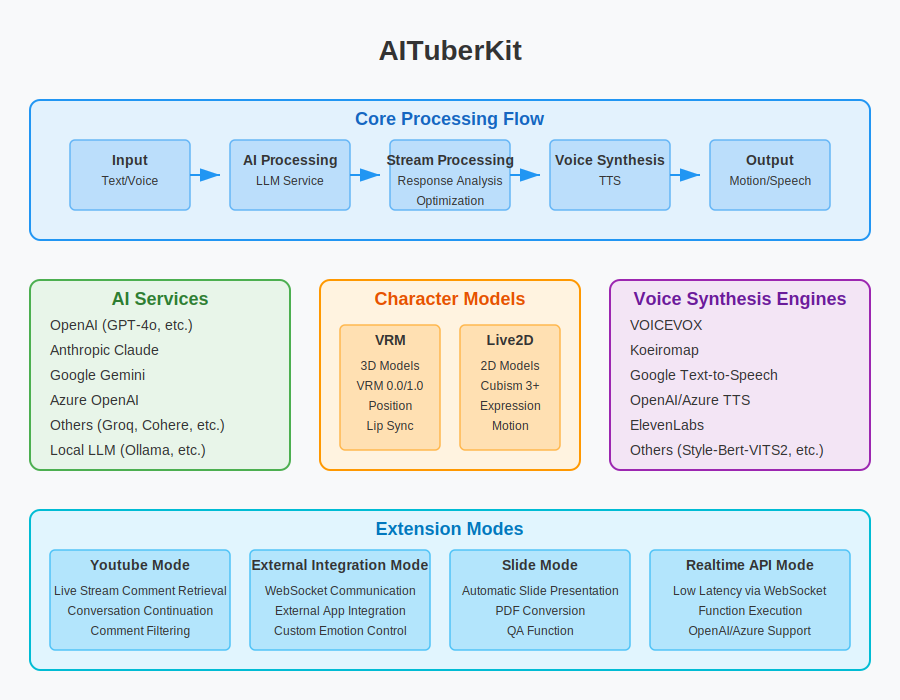

# AITuberKit


**Ogłoszenie: Od wersji v2.0.0 projekt ten przyjął niestandardową licencję. W przypadku użytku komercyjnego prosimy o zapoznanie się z sekcją [Warunki użytkowania](#warunki-użytkowania).**

<p align="center">
   <a href="https://github.com/tegnike/aituber-kit"></a>
   <a href="https://github.com/tegnike/aituber-kit"></a>
   
   <a href="https://github.com/tegnike/aituber-kit/blob/main/LICENSE"></a>
</p>
<p align="center">
   <a href="https://github.com/tegnike/aituber-kit/stargazers"></a>
   <a href="https://github.com/tegnike/aituber-kit/network/members"></a>
   <a href="https://github.com/tegnike/aituber-kit/graphs/contributors"></a>
   <a href="https://github.com/tegnike/aituber-kit/issues"></a>
</p>
<p align="center">
   <a href="https://x.com/tegnike"></a>
   <a href="https://discord.gg/5rHEue52nZ"></a>
   <a href="https://github.com/sponsors/tegnike"></a>
</p>

<div align="center">
   <h3>
      🌟 <a href="https://aituberkit.com">Przejdź do strony demo</a> 🌟
   </h3>
</div>

<div align="center">
   <h3>
      📚 <a href="https://docs.aituberkit.com/en/">Przejdź do dokumentacji</a> 📚
   </h3>
</div>

<h3 align="center">
   <a href="../README.md">日本語</a>｜
   <a href="./README_en.md">English</a>｜
   <a href="./README_zh.md">中文</a>｜
   <a href="./README_ko.md">한국어</a>
</h3>

## Przegląd

AITuberKit to zestaw narzędzi open source, który pozwala każdemu łatwo zbudować aplikację internetową do czatowania z postaciami AI.<br>
Obsługuje różnorodne usługi AI, modele postaci i silniki syntezy mowy, oferując różne tryby rozszerzeń, koncentrując się na funkcjach dialogowych i streamingowych AITuber z wysokim stopniem personalizacji.



Szczegółowe instrukcje użytkowania i konfiguracji można znaleźć w [dokumentacji](https://docs.aituberkit.com/en/).

## Historia gwiazdek

[](https://star-history.com/#tegnike/aituber-kit&Date)

## Główne funkcje

### 1. Interakcja z postaciami AI

- Łatwa rozmowa z postaciami AI przy użyciu kluczy API różnych LLM
- Obsługa multimodalna z rozpoznawaniem obrazów z kamery i przesłanych zdjęć
- Zachowywanie ostatnich rozmów w pamięci

### 2. Streaming AITuber

- Automatyczne odpowiedzi postaci AI na komentarze ze streamów YouTube
- Tryb ciągłej rozmowy umożliwiający spontaniczne wypowiedzi nawet bez komentarzy
- Funkcja pomijania komentarzy rozpoczynających się od "#"

### 3. Inne funkcje

- **Tryb integracji zewnętrznej**: Zaawansowane funkcje poprzez połączenie WebSocket z aplikacją serwerową
- **Tryb prezentacji**: Tryb automatycznej prezentacji slajdów przez postać AI
- **API czasu rzeczywistego**: Rozmowy i wykonywanie funkcji z niskim opóźnieniem przy użyciu OpenAI Realtime API
- **Tryb audio**: Naturalna konwersacja głosowa wykorzystująca OpenAI Audio API
- **Funkcja odbierania wiadomości**: Możliwość wydawania poleceń postaci AI poprzez dedykowane API

## Obsługiwane modele i usługi

### Modele postaci

- **Modele 3D**: Pliki VRM
- **Modele 2D**: Pliki Live2D (Cubism 3 i nowsze)

### Obsługiwane LLM

- OpenAI
- Anthropic
- Google Gemini
- Azure OpenAI
- Groq
- Cohere
- Mistral AI
- Perplexity
- Fireworks
- Lokalne LLM
- Dify

### Obsługiwane silniki syntezy mowy

- VOICEVOX
- Koeiromap
- Google Text-to-Speech
- Style-Bert-VITS2
- AivisSpeech
- GSVI TTS
- ElevenLabs
- OpenAI
- Azure OpenAI
- Nijivoice

## Szybki start

### Środowisko programistyczne

- Node.js: ^20.0.0
- npm: ^10.0.0

### Instrukcje instalacji

1. Sklonuj repozytorium lokalnie.

```bash
git clone https://github.com/tegnike/aituber-kit.git
```

2. Otwórz folder.

```bash
cd aituber-kit
```

3. Zainstaluj pakiety.

```bash
npm install
```

4. Uruchom aplikację w trybie deweloperskim.

```bash
npm run dev
```

5. Otwórz URL: [http://localhost:3000](http://localhost:3000)

6. W razie potrzeby utwórz plik .env.

```bash
cp .env.example .env
```

Szczegółowe instrukcje konfiguracji i użytkowania można znaleźć w [dokumentacji](https://docs.aituberkit.com/en/).

## ⚠️ Ważne uwagi dotyczące bezpieczeństwa

To repozytorium jest przeznaczone zarówno do użytku osobistego i rozwoju w środowisku lokalnym, jak i do użytku komercyjnego z odpowiednimi środkami bezpieczeństwa. Jednak podczas wdrażania w środowisku internetowym należy zwrócić uwagę na następujące punkty:

- **Obsługa kluczy API**: Ponieważ system jest zaprojektowany do wywoływania API usług AI (OpenAI, Anthropic itp.) i usług TTS poprzez serwer backendowy, wymagane jest odpowiednie zarządzanie kluczami API.

### Użycie w środowisku produkcyjnym

W przypadku użycia w środowisku produkcyjnym zalecane jest jedno z następujących podejść:

1. **Implementacja serwera backendowego**: Zarządzanie kluczami API po stronie serwera i unikanie bezpośredniego dostępu do API z klienta
2. **Odpowiednie instrukcje dla użytkowników**: W przypadku gdy użytkownicy używają własnych kluczy API, wyjaśnienie kwestii bezpieczeństwa
3. **Implementacja kontroli dostępu**: W razie potrzeby wdrożenie odpowiednich mechanizmów uwierzytelniania i autoryzacji

## Poszukiwani sponsorzy

Poszukujemy sponsorów, aby kontynuować rozwój.<br>
Twoje wsparcie znacząco przyczyni się do rozwoju i ulepszania AITuberKit.

[](https://github.com/sponsors/tegnike)

[](https://buymeacoffee.com/fdanv1k6iz)

### Współpracownicy (w kolejności wsparcia)

<p>
  <a href="https://github.com/morioki3" title="morioki3">
    
  </a>
  <a href="https://github.com/hodachi-axcxept" title="hodachi-axcxept">
    
  </a>
  <a href="https://github.com/coderabbitai" title="coderabbitai">
    
  </a>
  <a href="https://github.com/ai-bootcamp-tokyo" title="ai-bootcamp-tokyo">
    
  </a>
  <a href="https://github.com/wmoto-ai" title="wmoto-ai">
    
  </a>
  <a href="https://github.com/JunzoKamahara" title="JunzoKamahara">
    
  </a>
  <a href="https://github.com/darkgaldragon" title="darkgaldragon">
    
  </a>
  <a href="https://github.com/usagi917" title="usagi917">
    
  </a>
  <a href="https://github.com/ochisamu" title="ochisamu">
    
  </a>
  <a href="https://github.com/mo0013" title="mo0013">
    
  </a>
  <a href="https://github.com/tsubouchi" title="tsubouchi">
    
  </a>
  <a href="https://github.com/bunkaich" title="bunkaich">
    
  </a>
  <a href="https://github.com/seiki-aliveland" title="seiki-aliveland">
    
  </a>
  <a href="https://github.com/rossy8417" title="rossy8417">
    
  </a>
  <a href="https://github.com/gijigae" title="gijigae">
    
  </a>
  <a href="https://github.com/takm-reason" title="takm-reason">
    
  </a>
  <a href="https://github.com/haoling" title="haoling">
    
  </a>
  <a href="https://github.com/FoundD-oka" title="FoundD-oka">
    
  </a>
  <a href="https://github.com/terisuke" title="terisuke">
    
  </a>
  <a href="https://github.com/konpeita" title="konpeita">
    
  </a>
  <a href="https://github.com/MojaX2" title="MojaX2">
    
  </a>
  <a href="https://github.com/micchi99" title="micchi99">
    
  </a>
  <a href="https://github.com/nekomeowww" title="nekomeowww">
    
  </a>
  <a href="https://github.com/yfuku" title="yfuku">
    
  </a>
  <a href="https://x.com/8484ff_42" title="8484ff_42">
    
  </a>
  <a href="https://github.com/sher1ock-jp" title="sher1ock-jp">
    
  </a>
</p>

Plus kilku prywatnych sponsorów

## Warunki użytkowania

### Licencja

Od wersji v2.0.0 projekt ten przyjął **niestandardową licencję**.

- **Bezpłatne użytkowanie**

  - Dozwolone jest bezpłatne użytkowanie do celów osobistych (niekomercyjnych), edukacyjnych i non-profit.

- **Licencja komercyjna**
  - Do użytku komercyjnego wymagane jest uzyskanie oddzielnej licencji komercyjnej.
  - Szczegóły można znaleźć w [informacjach o licencji](./license_en.md).

### Inne

- [Warunki użytkowania logo](./logo_licence_pl.md)
- [Warunki użytkowania modeli VRM i Live2D](./character_model_licence_pl.md)

## Priorytetowa implementacja

W tym projekcie oferujemy płatną priorytetową implementację funkcji.

- Możliwa jest priorytetowa implementacja funkcji na życzenie firm lub osób prywatnych.
- Zaimplementowane funkcje będą publicznie dostępne jako część tego projektu open source.
- Opłaty są wyceniane indywidualnie w zależności od złożoności funkcji i czasu potrzebnego na implementację.
- Ta priorytetowa implementacja jest oddzielna od licencji komercyjnej. Do komercyjnego wykorzystania zaimplementowanych funkcji nadal wymagane jest uzyskanie oddzielnej licencji komercyjnej.

Aby uzyskać więcej informacji, prosimy o kontakt pod adresem support@aituberkit.com.
