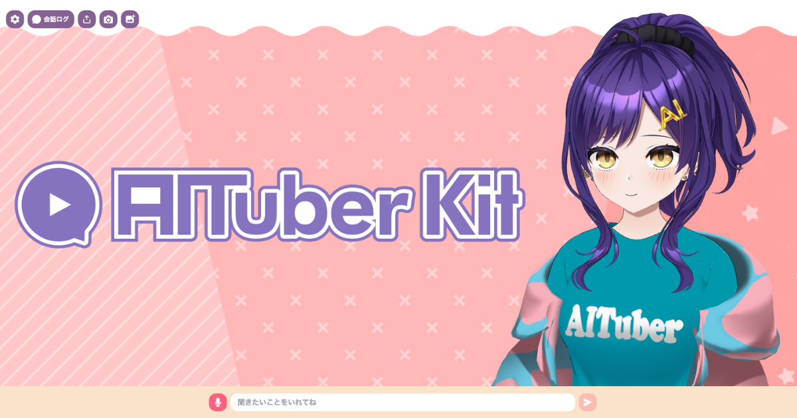

# AITuberKit



**通知：本專案從版本v2.0.0開始採用自定義許可證。如果您出於商業目的使用，請查看[使用條款](#使用條款)部分。**

<p align="center">
   <a href="https://github.com/tegnike/aituber-kit"></a>
   <a href="https://github.com/tegnike/aituber-kit"></a>
   
   <a href="https://github.com/tegnike/aituber-kit/blob/main/LICENSE"></a>
</p>
<p align="center">
   <a href="https://github.com/tegnike/aituber-kit/stargazers"></a>
   <a href="https://github.com/tegnike/aituber-kit/network/members"></a>
   <a href="https://github.com/tegnike/aituber-kit/graphs/contributors"></a>
   <a href="https://github.com/tegnike/aituber-kit/issues"></a>
   <a href="https://coderabbit.ai/tegnike/aituber-kit"></a>
</p>
<p align="center">
   <a href="https://x.com/tegnike"></a>
   <a href="https://discord.gg/5rHEue52nZ"></a>
   <a href="https://github.com/sponsors/tegnike"></a>
   <a href="https://deepwiki.com/tegnike/aituber-kit"></a>
</p>

<div align="center">
   <h3>
      🌟 <a href="https://aituberkit.com">演示網站</a> 🌟
   </h3>
</div>

<div align="center">
   <h3>
      📚 <a href="https://docs.aituberkit.com/zh/">文檔網站</a> 📚
   </h3>
</div>

<h3 align="center">
   <a href="../README.md">日本語</a>｜
   <a href="./README_en.md">English</a>｜
   <a href="./README_zh-CN.md">简体中文</a>｜
   <a href="./README_ko.md">한국어</a>｜
   <a href="./README_pl.md">Polski</a>
</h3>

## 概述

AITuberKit 是一個開源工具包，任何人都可以輕鬆構建能與 AI 角色聊天的 Web 應用程式。<br>
它支援豐富的 AI 服務、角色模型和語音合成引擎，提供高度可自訂的對話功能和 AITuber 直播功能，以及各種擴展模式。


有關詳細使用方法和配置說明，請訪問[文檔網站](https://docs.aituberkit.com/zh/)。

## Star 歷史

[](https://star-history.com/#tegnike/aituber-kit&Date)

## 主要功能

### 1. 與 AI 角色互動

- 使用各種 LLM 的 API 金鑰輕鬆與 AI 角色對話
- 支援多模態，可識別攝影機畫面和上傳的圖像生成回答
- 保留最近的對話作為記憶

### 2. AITuber 直播

- 取得 YouTube 直播評論，AI 角色自動回應
- 對話持續模式下即使沒有評論也能自發發言
- 以"#"開頭的評論不會被讀取的功能

### 3. 其他功能

- **外部整合模式**：透過 WebSocket 與伺服器應用程式連接，實現更進階的功能
- **幻燈片模式**：AI 角色自動展示幻燈片的模式
- **即時 API**：使用 OpenAI 的 Realtime API 實現低延遲對話和函數執行
- **音訊模式**：利用 OpenAI 的 Audio API 功能實現自然語音對話
- **訊息接收功能**：透過專用 API 接受外部指令，讓 AI 角色發言

## 支援的模型與服務

### 角色模型

- **3D 模型**：VRM 檔案
- **2D 模型**：Live2D 檔案（Cubism 3 及以後版本）

### 支援的 LLM

- OpenAI
- Anthropic
- Google Gemini
- Azure OpenAI
- Groq
- Cohere
- Mistral AI
- Perplexity
- Fireworks
- 本地 LLM
- Dify

### 支援的語音合成引擎

- VOICEVOX
- Koeiromap
- Google Text-to-Speech
- Style-Bert-VITS2
- AivisSpeech
- Aivis Cloud API
- Cartesia
- GSVI TTS
- ElevenLabs
- OpenAI
- Azure OpenAI
- Niji Voice

## 快速開始

### 開發環境

- Node.js: 24.x
- npm: ^11.6.2

### 安裝步驟

1.  將倉庫克隆到本地。

```bash
git clone https://github.com/tegnike/aituber-kit.git
```

2.  開啟資料夾。

```bash
cd aituber-kit
```

3.  安裝套件。

```bash
npm install
```

4.  在開發模式下啟動應用程式。

```bash
npm run dev
```

5.  開啟網址：[http://localhost:3000](http://localhost:3000)

6.  根據需要建立 .env 檔案。

```bash
cp .env.example .env
```

有關詳細配置和使用說明，請訪問[文件網站](https://docs.aituberkit.com/zh/)。

## ⚠️ 重要安全注意事項

本倉庫適用於個人使用和本地環境開發，以及採取適當安全措施的商業用途。但是，在部署到 Web 環境時，請注意以下幾點：

- **API 金鑰處理**：系統設計為透過後端伺服器呼叫 AI 服務（OpenAI、Anthropic 等）和 TTS 服務的 API，因此需要妥善管理 API 金鑰。

### 生產環境使用

在生產環境中使用時，我們建議採取以下方法之一：

1.  **後端伺服器實作**：在伺服器端管理 API 金鑰，避免用戶端直接存取 API
2.  **向使用者適當說明**：如果使用者使用自己的 API 金鑰，向他們解釋安全注意事項
3.  **存取限制實作**：根據需要實施適當的身分驗證和授權機制

## 贊助

我們正在尋求贊助者以繼續開發。<br>
您的支持將極大地促進 AITuberKit 的開發和改進。

[](https://github.com/sponsors/tegnike)

[](https://buymeacoffee.com/fdanv1k6iz)

### 貢獻者（按支持順序）

<p>
  <a href="https://github.com/morioki3" title="morioki3">
    
  </a>
  <a href="https://github.com/hodachi-axcxept" title="hodachi-axcxept">
    
  </a>
  <a href="https://github.com/coderabbitai" title="coderabbitai">
    
  </a>
  <a href="https://github.com/ai-bootcamp-tokyo" title="ai-bootcamp-tokyo">
    
  </a>
  <a href="https://github.com/wmoto-ai" title="wmoto-ai">
    
  </a>
  <a href="https://github.com/JunzoKamahara" title="JunzoKamahara">
    
  </a>
  <a href="https://github.com/darkgaldragon" title="darkgaldragon">
    
  </a>
  <a href="https://github.com/usagi917" title="usagi917">
    
  </a>
  <a href="https://github.com/ochisamu" title="ochisamu">
    
  </a>
  <a href="https://github.com/mo0013" title="mo0013">
    
  </a>
  <a href="https://github.com/tsubouchi" title="tsubouchi">
    
  </a>
  <a href="https://github.com/bunkaich" title="bunkaich">
    
  </a>
  <a href="https://github.com/seiki-aliveland" title="seiki-aliveland">
    
  </a>
  <a href="https://github.com/rossy8417" title="rossy8417">
    
  </a>
  <a href="https://github.com/gijigae" title="gijigae">
    
  </a>
  <a href="https://github.com/takm-reason" title="takm-reason">
    
  </a>
  <a href="https://github.com/haoling" title="haoling">
    
  </a>
  <a href="https://github.com/FoundD-oka" title="FoundD-oka">
    
  </a>
  <a href="https://github.com/terisuke" title="terisuke">
    
  </a>
  <a href="https://github.com/konpeita" title="konpeita">
    
  </a>
  <a href="https://github.com/MojaX2" title="MojaX2">
    
  </a>
  <a href="https://github.com/micchi99" title="micchi99">
    
  </a>
  <a href="https://github.com/nekomeowww" title="nekomeowww">
    
  </a>
  <a href="https://github.com/yfuku" title="yfuku">
    
  </a>
  <a href="https://x.com/8484ff_42" title="8484ff_42">
    
  </a>
  <a href="https://github.com/sher1ock-jp" title="sher1ock-jp">
    
  </a>
  <a href="https://github.com/uwaguchi" title="uwaguchi">
    
  </a>
  <a href="https://x.com/M1RA_A_Project" title="M1RA_A_Project">
    
  </a>
  <a href="https://github.com/teruPP" title="teruPP">
    
  </a>
  <a href="https://github.com/aituber-akari" title="aituber-akari">
    
  </a>
  <a href="https://github.com/harumeri" title="harumeri">
    
  </a>
  <a href="https://github.com/spring-hh" title="spring-hh">
    
  </a>
  <a href="https://github.com/dotneet" title="dotneet">
    
  </a>
  <a href="https://github.com/schroneko" title="schroneko">
    
  </a>
</p>

此外還有多位私人贊助者

## 貢獻

感謝您對 AITuberKit 開發的關注。我們歡迎來自社群的貢獻。

### 問題報告

如果您發現了錯誤或有新功能的想法，請透過 GitHub 的 [Issues](https://github.com/tegnike/aituber-kit/issues) 頁面告知我們。

建立問題時，包含以下資訊將有助於我們順利響應：

- 問題或新功能的詳細描述
- 重現步驟（對於錯誤）
- 預期行為與實際行為
- 使用環境（瀏覽器、作業系統、Node.js 版本等）
- 螢幕截圖或影片（如果可能）

### 拉取請求

如果您想改進程式碼或新增功能，請在您的 fork 倉庫中進行變更並建立拉取請求。

- 一個拉取請求應專注於一個功能或修復。
- 請在拉取請求描述中說明變更內容和理由。
- 合併目標分支必須設定為 `develop`。
- 不要強行解決衝突。開發團隊會處理這些問題。

## 使用條款

### 授權條款

本專案從版本 v2.0.0 開始採用**自訂授權條款**。

- **免費使用**
  - 非商業目的之個人使用、教育目的及非營利目的之使用皆可免費使用。

- **商業授權**
  - 商業用途需取得個別商業授權。
  - 詳情請參閱[關於授權條款](./license_en.md)。

### 其他

- [標誌使用條款](./logo_licence_zh-TW.md)
- [VRM 和 Live2D 模型使用條款](./character_model_licence_zh-TW.md)

## 優先實施

本專案接受付費優先實施功能。

- 可以優先實施企業或個人要求的功能。
- 實施的功能將作為本 OSS 專案的一部分發布。
- 費用將根據功能的複雜性與實施所需時間個別報價。
- 此優先實施與商業授權是分開的。若您想將實施的功能用於商業目的，需要另外取得商業授權。

詳情請聯繫 support@aituberkit.com。
