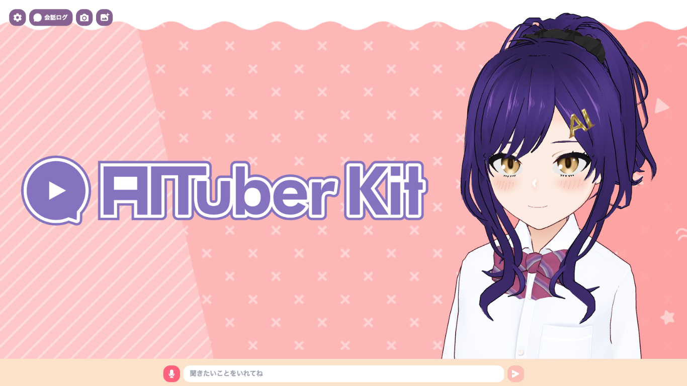
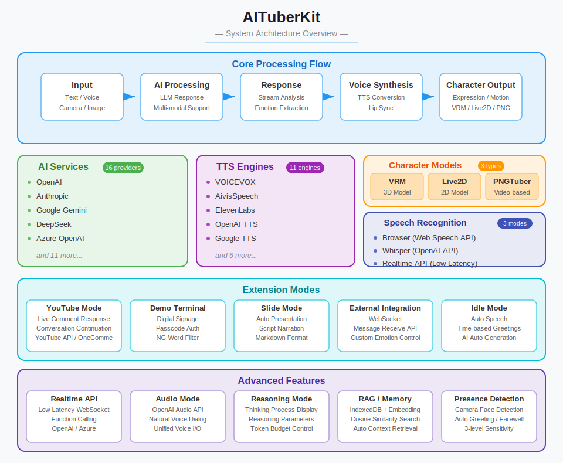

# AITuberKit



**通知：本项目从版本v2.0.0开始采用自定义许可证。如果您出于商业目的使用，请查看[使用条款](#使用条款)部分。**

<p align="center">
   <a href="https://github.com/tegnike/aituber-kit"></a>
   <a href="https://github.com/tegnike/aituber-kit"></a>
   
   <a href="https://github.com/tegnike/aituber-kit/blob/main/LICENSE"></a>
</p>
<p align="center">
   <a href="https://github.com/tegnike/aituber-kit/stargazers"></a>
   <a href="https://github.com/tegnike/aituber-kit/network/members"></a>
   <a href="https://github.com/tegnike/aituber-kit/graphs/contributors"></a>
   <a href="https://github.com/tegnike/aituber-kit/issues"></a>
   <a href="https://coderabbit.ai/tegnike/aituber-kit"></a>
</p>
<p align="center">
   <a href="https://x.com/tegnike"></a>
   <a href="https://discord.gg/5rHEue52nZ"></a>
   <a href="https://github.com/sponsors/tegnike"></a>
</p>

<div align="center">
   <h3>
      🌟 <a href="https://aituberkit.com">演示网站</a> 🌟
   </h3>
</div>

<div align="center">
   <h3>
      📚 <a href="https://docs.aituberkit.com/zh/">文档网站</a> 📚
   </h3>
</div>

<h3 align="center">
   <a href="../README.md">日本語</a>｜
   <a href="./README_en.md">English</a>｜
   <a href="./README_ko.md">한국어</a>｜
   <a href="./docs/README_pl.md">Polski</a>
</h3>

## 概述

AITuberKit是一个开源工具包，任何人都可以轻松构建能与AI角色聊天的Web应用程序。<br>
它支持丰富的AI服务、角色模型和语音合成引擎，提供高度可定制的对话功能和AITuber直播功能，以及各种扩展模式。



有关详细使用方法和配置说明，请访问[文档网站](https://docs.aituberkit.com/zh/)。

## Star历史

[](https://star-history.com/#tegnike/aituber-kit&Date)

## 主要功能

### 1. 与AI角色交互

- 使用各种LLM的API密钥轻松与AI角色对话
- 支持多模态，可识别摄像头画面和上传的图像生成回答
- 保留最近的对话作为记忆

### 2. AITuber直播

- 获取YouTube直播评论，AI角色自动回应
- 对话持续模式下即使没有评论也能自发发言
- 以"#"开头的评论不会被读取的功能

### 3. 其他功能

- **外部集成模式**：通过WebSocket与服务器应用程序连接，实现更高级的功能
- **幻灯片模式**：AI角色自动展示幻灯片的模式
- **实时API**：使用OpenAI的Realtime API实现低延迟对话和函数执行
- **音频模式**：利用OpenAI的Audio API功能实现自然语音对话
- **消息接收功能**：通过专用API接受外部指令，让AI角色发言

## 支持的模型和服务

### 角色模型

- **3D模型**：VRM文件
- **2D模型**：Live2D文件（Cubism 3及以后版本）

### 支持的LLM

- OpenAI
- Anthropic
- Google Gemini
- Azure OpenAI
- Groq
- Cohere
- Mistral AI
- Perplexity
- Fireworks
- 本地LLM
- Dify

### 支持的语音合成引擎

- VOICEVOX
- Koeiromap
- Google Text-to-Speech
- Style-Bert-VITS2
- AivisSpeech
- GSVI TTS
- ElevenLabs
- OpenAI
- Azure OpenAI
- Niji Voice

## 快速开始

### 开发环境

- Node.js: ^20.0.0
- npm: ^10.0.0

### 安装步骤

1. 将仓库克隆到本地。

```bash
git clone https://github.com/tegnike/aituber-kit.git
```

2. 打开文件夹。

```bash
cd aituber-kit
```

3. 安装包。

```bash
npm install
```

4. 在开发模式下启动应用程序。

```bash
npm run dev
```

5. 打开URL：[http://localhost:3000](http://localhost:3000)

6. 根据需要创建.env文件。

```bash
cp .env.example .env
```

有关详细配置和使用说明，请访问[文档网站](https://docs.aituberkit.com/zh/)。

## ⚠️ 重要安全注意事项

本仓库适用于个人使用和本地环境开发，以及采取适当安全措施的商业用途。但是，在部署到Web环境时，请注意以下几点：

- **API密钥处理**：系统设计为通过后端服务器调用AI服务（OpenAI、Anthropic等）和TTS服务的API，因此需要妥善管理API密钥。

### 生产环境使用

在生产环境中使用时，我们建议采取以下方法之一：

1. **后端服务器实现**：在服务器端管理API密钥，避免客户端直接访问API
2. **向用户适当说明**：如果用户使用自己的API密钥，向他们解释安全注意事项
3. **访问限制实现**：根据需要实施适当的身份验证和授权机制

## 赞助

我们正在寻求赞助者以继续开发。<br>
您的支持将极大地促进AITuberKit的开发和改进。

[](https://github.com/sponsors/tegnike)

[](https://buymeacoffee.com/fdanv1k6iz)

### 贡献者（按支持顺序）

<p>
  <a href="https://github.com/morioki3" title="morioki3">
    
  </a>
  <a href="https://github.com/hodachi-axcxept" title="hodachi-axcxept">
    
  </a>
  <a href="https://github.com/coderabbitai" title="coderabbitai">
    
  </a>
  <a href="https://github.com/ai-bootcamp-tokyo" title="ai-bootcamp-tokyo">
    
  </a>
  <a href="https://github.com/wmoto-ai" title="wmoto-ai">
    
  </a>
  <a href="https://github.com/JunzoKamahara" title="JunzoKamahara">
    
  </a>
  <a href="https://github.com/darkgaldragon" title="darkgaldragon">
    
  </a>
  <a href="https://github.com/usagi917" title="usagi917">
    
  </a>
  <a href="https://github.com/ochisamu" title="ochisamu">
    
  </a>
  <a href="https://github.com/mo0013" title="mo0013">
    
  </a>
  <a href="https://github.com/tsubouchi" title="tsubouchi">
    
  </a>
  <a href="https://github.com/bunkaich" title="bunkaich">
    
  </a>
  <a href="https://github.com/seiki-aliveland" title="seiki-aliveland">
    
  </a>
  <a href="https://github.com/rossy8417" title="rossy8417">
    
  </a>
  <a href="https://github.com/gijigae" title="gijigae">
    
  </a>
  <a href="https://github.com/takm-reason" title="takm-reason">
    
  </a>
  <a href="https://github.com/haoling" title="haoling">
    
  </a>
  <a href="https://github.com/FoundD-oka" title="FoundD-oka">
    
  </a>
  <a href="https://github.com/terisuke" title="terisuke">
    
  </a>
  <a href="https://github.com/konpeita" title="konpeita">
    
  </a>
  <a href="https://github.com/MojaX2" title="MojaX2">
    
  </a>
  <a href="https://github.com/micchi99" title="micchi99">
    
  </a>
  <a href="https://github.com/nekomeowww" title="nekomeowww">
    
  </a>
  <a href="https://github.com/yfuku" title="yfuku">
    
  </a>
  <a href="https://x.com/8484ff_42" title="8484ff_42">
    
  </a>
  <a href="https://github.com/sher1ock-jp" title="sher1ock-jp">
    
  </a>
  <a href="https://github.com/uwaguchi" title="uwaguchi">
    
  </a>
  <a href="https://x.com/M1RA_A_Project" title="M1RA_A_Project">
    
  </a>
</p>

此外还有多位私人赞助者

## 使用条款

### 许可证

本项目从版本v2.0.0开始采用**自定义许可证**。

- **免费使用**

  - 非商业目的的个人使用、教育目的和非营利目的的使用可以免费使用。

- **商业许可证**
  - 商业用途需要获取单独的商业许可证。
  - 详情请查看[关于许可证](./license_en.md)。

### 其他

- [标志使用条款](./logo_licence_zh.md)
- [VRM和Live2D模型使用条款](./character_model_licence_zh.md)

## 优先实施

本项目接受付费优先实施功能。

- 可以优先实施企业或个人要求的功能。
- 实施的功能将作为本OSS项目的一部分发布。
- 费用根据功能的复杂性和实施所需时间单独报价。
- 这种优先实施与商业许可证是分开的。如果您想将实施的功能用于商业目的，需要单独获取商业许可证。

详情请联系support@aituberkit.com。
