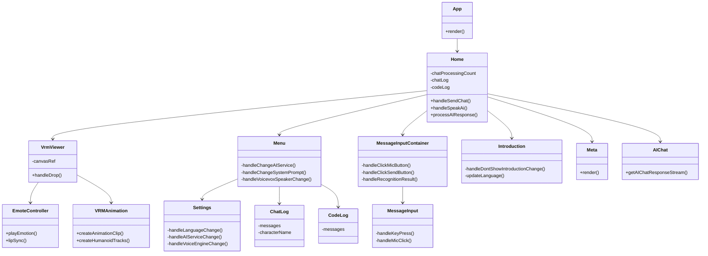

```mermaid

classDiagram
    class App {
        +render()
    }
    
    class Home {
        -chatProcessingCount
        -chatLog
        -codeLog
        +handleSendChat()
        +handleSpeakAi()
        +processAIResponse()
    }

    class VrmViewer {
        -canvasRef
        +handleDrop()
    }

    class Menu {
        -handleChangeAIService()
        -handleChangeSystemPrompt()
        -handleVoicevoxSpeakerChange()
    }

    class MessageInputContainer {
        -handleClickMicButton()
        -handleClickSendButton()
        -handleRecognitionResult()
    }

    class Settings {
        -handleLanguageChange()
        -handleAIServiceChange()
        -handleVoiceEngineChange()
    }

    class ChatLog {
        -messages
        -characterName
    }

    class CodeLog {
        -messages
    }

    class Introduction {
        -handleDontShowIntroductionChange()
        -updateLanguage()
    }

    class MessageInput {
        -handleKeyPress()
        -handleMicClick()
    }

    class Meta {
        +render()
    }

    App --> Home
    Home --> VrmViewer
    Home --> Menu
    Home --> MessageInputContainer
    Home --> Introduction
    Home --> Meta
    Menu --> Settings
    Menu --> ChatLog
    Menu --> CodeLog
    MessageInputContainer --> MessageInput

    %% Services and Utils
    class AIChat {
        +getAIChatResponseStream()
    }
    
    class EmoteController {
        +playEmotion()
        +lipSync()
    }
    
    class VRMAnimation {
        +createAnimationClip()
        +createHumanoidTracks()
    }

    Home --> AIChat
    VrmViewer --> EmoteController
    VrmViewer --> VRMAnimation

```