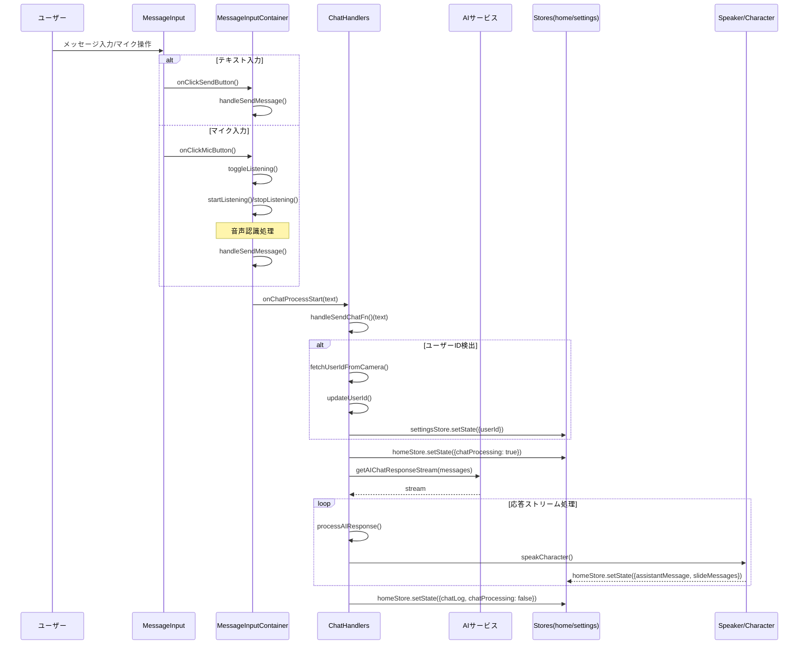

```mermaid
sequenceDiagram
    participant User as ユーザー
    participant Input as MessageInput
    participant Container as MessageInputContainer
    participant Handlers as ChatHandlers
    participant API as AIサービス
    participant Store as Stores(home/settings)
    participant Speaker as Speaker/Character

    User->>Input: メッセージ入力/マイク操作
    
    alt テキスト入力
        Input->>Container: onClickSendButton()
        Container->>Container: handleSendMessage()
    else マイク入力
        Input->>Container: onClickMicButton()
        Container->>Container: toggleListening()
        Container->>Container: startListening()/stopListening()
        Note over Container: 音声認識処理
        Container->>Container: handleSendMessage()
    end
    
    Container->>Handlers: onChatProcessStart(text)
    Handlers->>Handlers: handleSendChatFn()(text)
    
    alt ユーザーID検出
        Handlers->>Handlers: fetchUserIdFromCamera()
        Handlers->>Handlers: updateUserId()
        Handlers->>Store: settingsStore.setState({userId})
    end
    
    Handlers->>Store: homeStore.setState({chatProcessing: true})
    Handlers->>API: getAIChatResponseStream(messages)
    API-->>Handlers: stream
    
    loop 応答ストリーム処理
        Handlers->>Handlers: processAIResponse()
        Handlers->>Speaker: speakCharacter()
        Speaker-->>Store: homeStore.setState({assistantMessage, slideMessages})
    end
    
    Handlers->>Store: homeStore.setState({chatLog, chatProcessing: false})
```