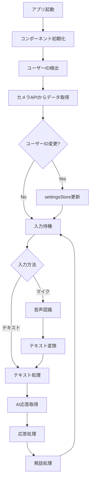

```mermaid
flowchart TB
    Start[アプリ起動] --> InitComponents[コンポーネント初期化]
    InitComponents --> DetectUser[ユーザーID検出]
    
    DetectUser --> FetchCamera[カメラAPIからデータ取得]
    FetchCamera --> CheckUser{ユーザーID変更?}
    
    CheckUser -->|Yes| UpdateUser[settingsStore更新]
    CheckUser -->|No| WaitInput[入力待機]
    UpdateUser --> WaitInput
    
    WaitInput --> UserInput{入力方法}
    UserInput -->|テキスト| ProcessText[テキスト処理]
    UserInput -->|マイク| ProcessVoice[音声認識]
    
    ProcessVoice --> ConvertToText[テキスト変換]
    ConvertToText --> ProcessText
    
    ProcessText --> SendToAI[AI応答取得]
    SendToAI --> ProcessResponse[応答処理]
    ProcessResponse --> SpeakResponse[発話処理]
    SpeakResponse --> WaitInput
```