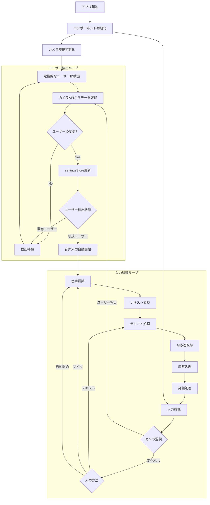

```mermaid
flowchart TB
    Start[アプリ起動] --> InitComponents[コンポーネント初期化]
    InitComponents --> InitCam[カメラ監視初期化]
    InitCam --> DetectUser[定期的なユーザーID検出]
    
    subgraph "ユーザー検出ループ"
        DetectUser --> FetchCamera[カメラAPIからデータ取得]
        FetchCamera --> CheckUser{ユーザーID変更?}
        CheckUser -->|Yes| UpdateUser[settingsStore更新]
        CheckUser -->|No| WaitDetection[検出待機]
        UpdateUser --> UserDetected{ユーザー検出状態}
        UserDetected -->|新規ユーザー| AutoStartVoice[音声入力自動開始]
        UserDetected -->|既存ユーザー| WaitDetection
        WaitDetection --> DetectUser
    end
    
    subgraph "入力処理ループ"
        WaitInput[入力待機] --> CamCheck{カメラ監視}
        CamCheck -->|ユーザー検出| FetchCamera
        CamCheck -->|変化なし| UserInput{入力方法}
        
        UserInput -->|テキスト| ProcessText[テキスト処理]
        UserInput -->|マイク| ProcessVoice[音声認識]
        UserInput -->|自動開始| ProcessVoice
        
        ProcessVoice --> ConvertToText[テキスト変換]
        ConvertToText --> ProcessText
        
        ProcessText --> SendToAI[AI応答取得]
        SendToAI --> ProcessResponse[応答処理]
        ProcessResponse --> SpeakResponse[発話処理]
        SpeakResponse --> WaitInput
    end
    
    InitComponents --> WaitInput
    AutoStartVoice --> ProcessVoice
```