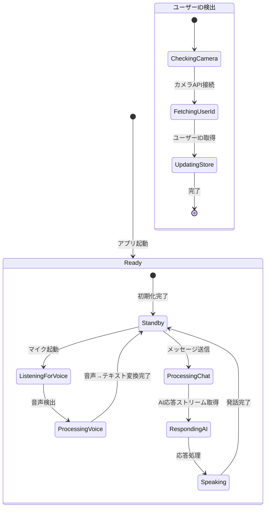

```mermaid
stateDiagram-v2
    [*] --> Ready: アプリ起動
    
    state Ready {
        [*] --> Standby: 初期化完了
        Standby --> ListeningForVoice: マイク起動
        ListeningForVoice --> ProcessingVoice: 音声検出
        ProcessingVoice --> Standby: 音声→テキスト変換完了
        
        Standby --> ProcessingChat: メッセージ送信
        ProcessingChat --> RespondingAI: AI応答ストリーム取得
        RespondingAI --> Speaking: 応答処理
        Speaking --> Standby: 発話完了
    }
    
    state "ユーザーID検出" as UserIdDetection {
        [*] --> CheckingCamera
        CheckingCamera --> FetchingUserId: カメラAPI接続
        FetchingUserId --> UpdatingStore: ユーザーID取得
        UpdatingStore --> [*]: 完了
    }
```